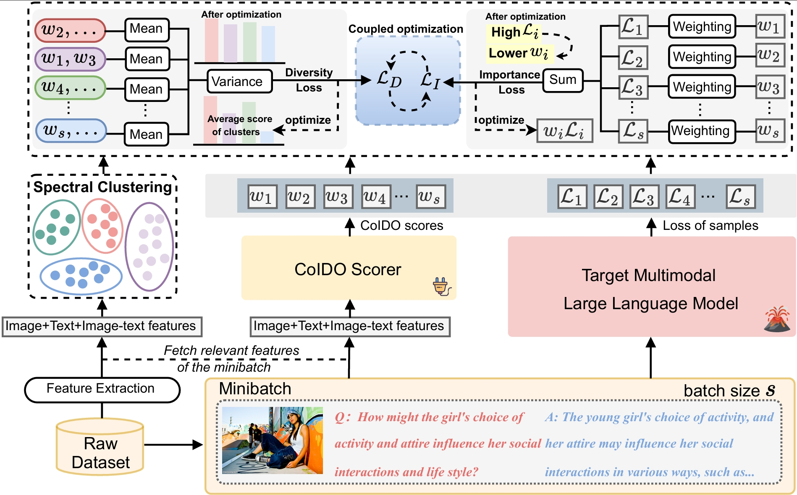

# CoIDO: Confidence-aware Instruction Data Optimization

<div align="center">
  
</div>

## Introduction

**CoIDO (Confidence-aware Instruction Data Optimization)** is a data selection framework for high-quality instruction tuning of vision-language models. This project is adapted and significantly improved from [Self-Filter](https://github.com/RayRuiboChen/Self-Filter).

### Key Features

- **Self-supervised Data Selection**: Uses the vision-language model itself as a filter for instruction tuning data
- **Multi-modal Feature Integration**: Combines CLIP features with multiple quality scores (CLIP score, ImageReward, LLM evaluation)
- **Dataset-aware Filtering**: Ensures diversity across different data sources during selection
- **Uncertainty-aware Training**: Incorporates learnable uncertainty parameters for balanced loss weighting
- **Clean and Modular**: Fully cleaned codebase with English documentation and relative paths

### Improvements over Original Self-Filter

- ✅ **Simplified Architecture**: Streamlined to focus on the most effective `clip+scores` configuration
- ✅ **Enhanced Documentation**: All Chinese comments translated to English with comprehensive docstrings
- ✅ **Standardized Paths**: All hardcoded absolute paths converted to relative paths
- ✅ **Optimized Parameters**: Removed unnecessary parameters and options for cleaner usage
- ✅ **Better Organization**: Restructured codebase with clear separation of concerns
- ✅ **Optional Clustering**: Added spectral clustering for enhanced diversity

## Installation

### 1. Environment Setup

First, clone this repository and set up LLaVA:

```bash
git clone https://github.com/your-username/CoIDO.git
cd CoIDO
git clone https://github.com/haotian-liu/LLaVA.git
```

Install the required dependencies following [LLaVA's installation guide](https://github.com/haotian-liu/LLaVA#install).

Additional dependencies for feature extraction:

```bash
pip install image-reward
pip install scikit-learn  # for clustering
```

### 2. Download Base Models

Download the required pretrained models:
- **Vicuna-7B-v1.5**: Base language model
- **CLIP-ViT-Large**: Vision encoder  
- **LLaVA Projector**: Pretrained vision-language projector

Organize them in your preferred model directory and update paths in the scripts accordingly.

## Data Preparation

### 1. Dataset Structure

Organize your data as follows:

```
./data/
├── images/                    # Training images (e.g., COCO train2017)
├── training_data.json        # Original instruction tuning data
├── scores/                   # Generated score files
│   ├── llava_clip_feature.pt
│   ├── llava_clipscore.json
│   ├── llava_imagereward.json
│   └── deepseek-chat/
│       └── processed_score.json
└── spectral_clustering_clip+scores_20_multi_gpu.json  # Optional clustering results
```

### 2. Data Processing Pipeline

#### Step 1: Preprocess Dataset
Add unique indices to each instruction sample:

```bash
bash scripts/preprocess.sh
```

#### Step 2: Extract Features

**CLIP Features**:
```bash
bash scripts/extract_clip_features.sh
```

**Quality Scores**:
```bash
# ImageReward scores
bash scripts/extract_imagereward_score.sh

# CLIP scores  
bash scripts/extract_clip_score.sh

# LLM evaluation (using DeepSeek as example)
export DEEPSEEK_API_KEY=your_api_key
bash scripts/query_deepseek.sh
bash scripts/process_deepseek_responses.sh
```

#### Step 3: Spectral Clustering (Optional)
For enhanced diversity, run spectral clustering:

```bash
bash scripts/run_spectral_clustering.sh
```

## Training Pipeline

### Stage 1: Difficulty Score Learning

Train the model to predict data difficulty using multi-modal features:

```bash
bash scripts/run_stage1.sh
```

**Key configurations**:
- Features: CLIP + Quality Scores
- Model: LLaVA with confidence-aware uncertainty weighting
- Optional: Spectral clustering for diversity enhancement

**Output**: Trained stage1 model in `./data/checkpoints/coido_stage1_20CLS/`

### Stage 2: Data Selection

Use the trained model to select high-quality instruction data:

```bash
bash scripts/run_stage2.sh
```

**Selection Strategy**:
- Dataset-proportional allocation ensures diversity across data sources
- Within each dataset, select samples with highest predicted difficulty
- No similarity-based filtering (simplified from original approach)

**Output**: Filtered dataset in `./data/filtered_training_data_20CLS.json`

## Project Structure

```
CoIDO/
├── coido/                     # Core model implementations
│   ├── stage1.py             # Stage 1 training script
│   ├── stage2.py             # Stage 2 data selection script  
│   ├── coido_model.py        # Model architecture definitions
│   └── coido_trainer.py      # Custom trainer with uncertainty weighting
├── scripts/                   # Shell scripts for pipeline execution
│   ├── preprocess.sh         # Data preprocessing
│   ├── extract_*.sh          # Feature extraction scripts
│   ├── run_stage1.sh         # Stage 1 training
│   ├── run_stage2.sh         # Stage 2 selection
│   └── run_spectral_clustering.sh  # Optional clustering
├── data_process/              # Python utilities for data processing
│   ├── preprocess.py         # Dataset preprocessing utilities
│   ├── extract_features.py   # Feature extraction implementations
│   ├── query_deepseek.py     # LLM API querying
│   ├── analysis_deepseek.py  # Response analysis
│   └── spectral_clustering.py # Clustering implementation
├── LLaVA/                     # LLaVA submodule
└── data/                      # Data directory (user-provided)
```

## Key Features

### Multi-modal Feature Integration
CoIDO combines multiple types of features for comprehensive quality assessment:
- **CLIP Features**: Dense visual-semantic representations (1536-dim)
- **CLIP Score**: Image-text alignment quality
- **ImageReward**: Human preference-based image quality
- **LLM Evaluation**: Language model assessment of instruction quality

### Uncertainty-aware Training
Uses learnable uncertainty parameters (σ₁, σ₂) to automatically balance:
- **Cross-entropy Loss**: Standard instruction following loss
- **Diversity Loss**: Optional clustering-based diversity enhancement

### Dataset-aware Selection
Instead of similarity-based filtering, CoIDO uses dataset-proportional allocation:
- Maintains diversity across different data sources
- Selects highest-difficulty samples within each dataset
- Simpler and more controllable than similarity-based approaches

## Configuration

### Key Parameters

**Stage 1 Training** (`scripts/run_stage1.sh`):
- `STAGE1_MODEL_PATH`: Base model path
- `N_CLUSTERS`: Number of clusters (if using clustering)
- `OUTPUT_DIR`: Training output directory

**Stage 2 Selection** (`scripts/run_stage2.sh`):
- `STAGE1_MODEL_PATH`: Trained stage1 model path  
- `FILTER_NUM`: Number of samples to select
- `RAW_ANNOTATION_PATH`: Original dataset path

### Customization

To adapt CoIDO for your use case:

1. **Different LLM APIs**: Modify `data_process/query_deepseek.py` for other LLM services
2. **Additional Features**: Extend feature extraction in `data_process/extract_features.py`
3. **Custom Selection**: Modify `dist_filter_with_dataset()` in `coido/stage2.py`

## Citation

This work is adapted from Self-Filter. If you use this code, please consider citing both:

**Original Self-Filter**:
```bibtex
@article{chen2024your,
  title={Your Vision-Language Model Itself Is a Strong Filter: Towards High-Quality Instruction Tuning with Data Selection},
  author={Chen, Ruibo and Wu, Yihan and Chen, Lichang and Liu, Guodong and He, Qi and Xiong, Tianyi and Liu, Chenxi and Guo, Junfeng and Huang, Heng},
  journal={arXiv preprint arXiv:2402.12501},
  year={2024}
}
```

**CoIDO** (when available):
```bibtex
@software{coido2024,
  title={CoIDO: Confidence-aware Instruction Data Optimization},
  author={Your Name},
  year={2024},
  url={https://github.com/your-username/CoIDO}
}
```

## License

This project is licensed under the AGPL-3.0 License - see the [LICENSE](LICENSE) file for details.

## Acknowledgments

- Original [Self-Filter](https://github.com/RayRuiboChen/Self-Filter) authors for the foundational framework
- [LLaVA](https://github.com/haotian-liu/LLaVA) team for the excellent vision-language model architecture
- [ImageReward](https://github.com/THUDM/ImageReward) for human preference-based image quality assessment
